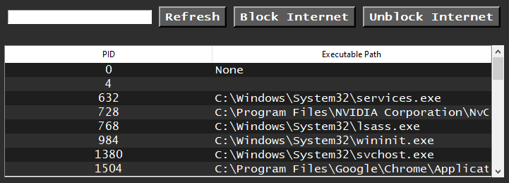

# Network Process Controller

Network Process Controller is a Python application built using the Tkinter GUI library that allows users to view and manage network-related processes on their system. The application supports blocking and unblocking internet access for specific processes on Windows and Linux platforms.

## Table of Contents

- [Features](#features)
- [Requirements](#requirements)
- [Installation](#installation)
- [Usage](#usage)
- [Screenshot](#screenshot)
- [Contributing](#contributing)

## Features

- **View Network Processes**: Displays a list of processes that are currently utilizing network connections.
- **Search Functionality**: Allows users to filter processes by name or executable path.
- **Block Internet Access**: Block internet access for selected processes.
- **Unblock Internet Access**: Unblock internet access for previously blocked processes.
- **Cross-Platform Support**: Works on both Windows and Linux systems.

## Requirements

- Python 3.x
- `psutil` library for process management
- Tkinter (comes pre-installed with Python)

## Installation

1. **Clone the repository**:
   ```sh
   git clone https://github.com/your-username/network-process-controller.git
   cd network-process-controller
   ```

## Install the required packages

2. **Clone the repository**:
   ```sh
    pip install psutil
   ```

## Run the application

3. **Clone the repository**:
   ```sh
    python network_process_controller.py
   ```


## Usage
* Start the application: Upon running the script, the application window will appear.
* View Processes: The application automatically lists processes with active network connections.
* Search: Use the search bar to filter processes by name or executable path.
* Block Internet: Select a process from the list and click the "Block Internet" button to prevent the process from accessing the network.
* Unblock Internet: Select a process and click the "Unblock Internet" button to restore its network access.


## Screenshot



## Contributing
Contributions are welcome! If you have any ideas, suggestions, or bug fixes, feel free to open an issue or submit a pull request.